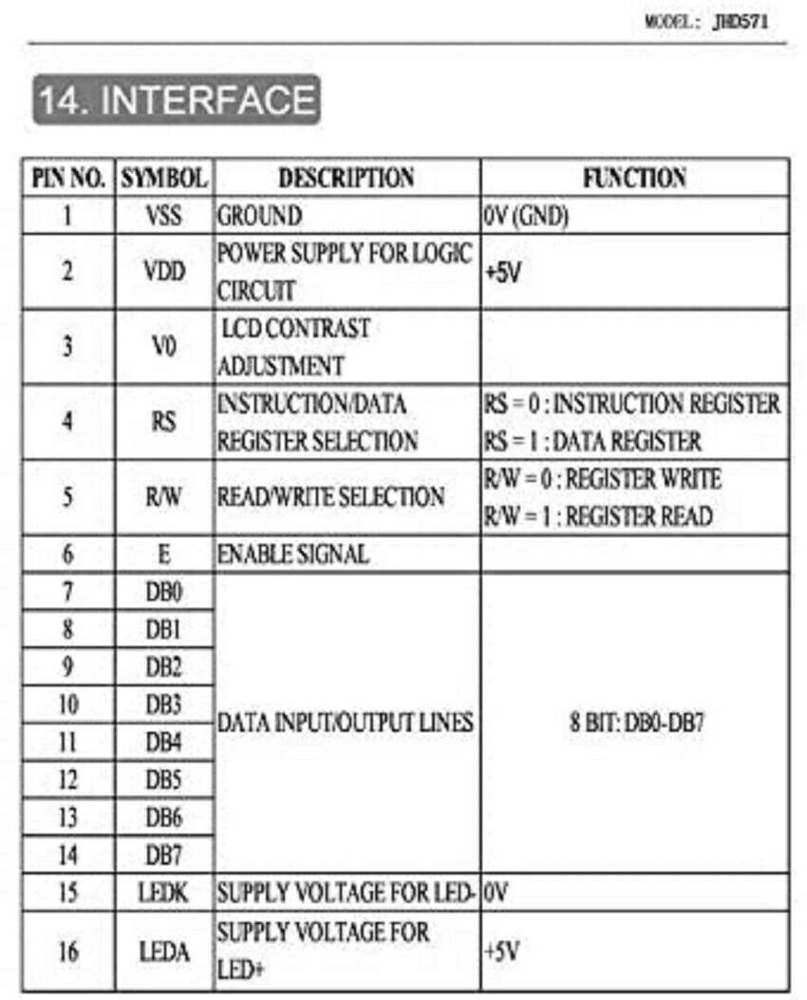

# Hardware

## Bluepill pinout

## Connections

| Pin  | Connection                                |
| ---- | ----------------------------------------- |
| PA9  | Debug TX1 / MIDI Out1+2                   |
| PA10 | Debug RX1 / MIDI IN                       |
| PB12 | Button1     		                           |
| PB13 | Button2     		                           |
| PA7  | Button3     		                           |
| PA6  | Button4 (Enc)                             |
| PA0  | Enc1                                      |
| PA1  | Enc2                                      |
| PA9  | MIDI OUT1+2 (Hex Buffer1+2)               |
| PB5  | TRIGGER1 (LED MIDI OUT1+2)                |
| PA2 | MIDI OUT3+4 (Hex Buffer3+4)                |
| PB4  | TRIGGER2 (LED MIDI OUT3+4)                |
| PB0  | TRIGGER3 (Hex Buffer5) & LED3             |
| PB1  | TRIGGER4 RESET (Hex Buffer6) & LED4       |
| PA11 | USB D-                                    |
| PA12 | USB D+                                    |
| PB3 |Clock In|
| PB6 |EEPROM IC SCL|
| PB7 |EEPROM IC SDA|
| PA8 |Display RS|
| PB15 |Display EN|
| PB11 |Display D4|
| PB10 |Display D5|
| PA4 |Display D6|
| PA5 |Display D7|

### Debugging with UART Adapter

Only connect TX to A9, RX to A10 and GND, no need for 3.3V connection

### HD44780 Display

### BOM

* Hex Buffer: 74HC 365
* Clock in: BC 635 Bipolartransistor, NPN, 45V, 1A, 0,8W, TO-92

